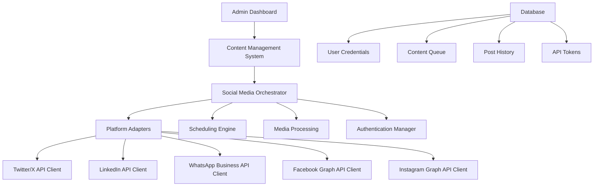

# Social Media Auto-Posting Implementation Guide

## Executive Summary

This document outlines the technical implementation requirements for building a unified social media auto-posting system that can distribute content across Facebook, WhatsApp, Twitter/X, LinkedIn, and Instagram groups using admin user credentials and phone numbers.

## 🚨 Critical Platform Changes (2024-2025)

### Facebook Groups API - **DISCONTINUED**
- **Status**: API completely discontinued as of April 22, 2024
- **Impact**: Third-party apps can NO LONGER post to Facebook Groups
- **Alternative**: Manual posting only or use RTMP streaming for live content

### Instagram Basic Display API - **LIMITED**
- **Status**: No posting capabilities through official API
- **Current**: Read-only access to user media and profile information
- **Alternative**: Instagram Graph API (business accounts only) or third-party solutions

## Platform-by-Platform Analysis

### 1. Facebook / Meta APIs

#### Facebook Groups ❌ **NOT POSSIBLE**
```
Status: API DISCONTINUED (April 2024)
Previous Requirements:
- Facebook Developer Account
- App Review Process
- publish_to_groups permission
- Business verification
```

**Current Limitations:**
- No third-party posting to Groups
- Manual posting required
- Live streaming via RTMP still possible with custom keys

#### Facebook Pages ✅ **POSSIBLE**
```javascript
// Facebook Graph API - Pages
POST https://graph.facebook.com/v18.0/{page-id}/feed
{
  "message": "Your post content",
  "access_token": "YOUR_PAGE_ACCESS_TOKEN"
}
```

**Requirements:**
- Facebook Developer Account
- Long-lived Page Access Token
- pages_manage_posts permission
- Business verification for advanced features

### 2. WhatsApp Business API

#### Status: ✅ **POSSIBLE** (with restrictions)

**Requirements:**
- WhatsApp Business Account (WABA)
- Phone number verification
- Facebook Business Manager
- Meta Business verification

**Key Capabilities:**
```javascript
// Send template message
POST https://graph.facebook.com/v18.0/{phone-number-id}/messages
{
  "messaging_product": "whatsapp",
  "to": "PHONE_NUMBER",
  "type": "template",
  "template": {
    "name": "template_name",
    "language": { "code": "en_US" }
  }
}
```

**Important Limitations:**
- Can only send to users who have opted in
- Template messages required for broadcast
- 24-hour messaging window for free-form messages
- No direct "group posting" - must message individual contacts

**Pricing (2025 Updates):**
- Per-message pricing (from July 2025)
- Free service conversations within 24-hour window
- Volume tiers for utility and authentication messages

### 3. Twitter/X API

#### Status: ✅ **POSSIBLE**

**Requirements:**
- X Developer Account (approved)
- API keys and access tokens
- OAuth 1.0a or OAuth 2.0 authentication

**Rate Limits:**
- POST: 200 requests per 15 minutes
- DELETE: 50 requests per 15 minutes
- Overall: 300 requests per 3 hours

```javascript
// Create post
POST https://api.x.com/2/tweets
{
  "text": "Your tweet content",
  "media": {
    "media_ids": ["media_id_1", "media_id_2"]
  }
}
```

**Capabilities:**
- Text posts with media
- Polls, quote tweets
- Geographic tagging
- Reply settings control

### 4. LinkedIn API

#### Status: ✅ **POSSIBLE**

**Requirements:**
- LinkedIn Developer Account
- OAuth 2.0 authentication
- w_member_social permission
- Company page association for organization posts

**Individual Posting:**
```javascript
// LinkedIn Posts API
POST https://api.linkedin.com/v2/ugcPosts
{
  "author": "urn:li:person:{person-id}",
  "lifecycleState": "PUBLISHED",
  "specificContent": {
    "com.linkedin.ugc.ShareContent": {
      "shareCommentary": {
        "text": "Your post content"
      },
      "shareMediaCategory": "NONE"
    }
  },
  "visibility": {
    "com.linkedin.ugc.MemberNetworkVisibility": "PUBLIC"
  }
}
```

**Company Page Posting:**
```javascript
// Company page posts
POST https://api.linkedin.com/v2/ugcPosts
{
  "author": "urn:li:organization:{company-id}",
  // ... rest of content
}
```

### 5. Instagram API

#### Status: ⚠️ **LIMITED**

**Instagram Graph API (Business Only):**
```javascript
// Create media container
POST https://graph.facebook.com/v18.0/{ig-user-id}/media
{
  "image_url": "https://example.com/image.jpg",
  "caption": "Your caption #hashtags",
  "access_token": "ACCESS_TOKEN"
}

// Publish media
POST https://graph.facebook.com/v18.0/{ig-user-id}/media_publish
{
  "creation_id": "{creation-id}",
  "access_token": "ACCESS_TOKEN"
}
```

**Requirements:**
- Instagram Business Account
- Linked to Facebook Page
- Facebook Developer App
- instagram_basic, instagram_content_publish permissions

**Limitations:**
- Business accounts only
- No direct personal account posting
- Complex setup process
- Limited automation capabilities

## Technical Architecture

### Core System Components



### Database Schema

```sql
-- Users and Authentication
CREATE TABLE admin_users (
    id UUID PRIMARY KEY,
    name VARCHAR(255),
    phone_number VARCHAR(20),
    created_at TIMESTAMP DEFAULT NOW()
);

CREATE TABLE social_accounts (
    id UUID PRIMARY KEY,
    user_id UUID REFERENCES admin_users(id),
    platform ENUM('twitter', 'linkedin', 'whatsapp', 'facebook', 'instagram'),
    account_identifier VARCHAR(255), -- username, phone, page_id, etc.
    access_token TEXT,
    refresh_token TEXT,
    token_expires_at TIMESTAMP,
    is_active BOOLEAN DEFAULT true,
    created_at TIMESTAMP DEFAULT NOW()
);

-- Content Management
CREATE TABLE content_posts (
    id UUID PRIMARY KEY,
    user_id UUID REFERENCES admin_users(id),
    title VARCHAR(255),
    content TEXT,
    media_urls TEXT[], -- Array of media URLs
    scheduled_at TIMESTAMP,
    target_platforms TEXT[], -- Array of platforms
    status ENUM('draft', 'scheduled', 'publishing', 'published', 'failed'),
    created_at TIMESTAMP DEFAULT NOW()
);

CREATE TABLE post_results (
    id UUID PRIMARY KEY,
    post_id UUID REFERENCES content_posts(id),
    platform VARCHAR(50),
    platform_post_id VARCHAR(255),
    success BOOLEAN,
    error_message TEXT,
    published_at TIMESTAMP,
    engagement_data JSONB -- likes, shares, comments, etc.
);
```

### Authentication Flow

#### 1. Twitter/X OAuth 2.0
```javascript
// OAuth 2.0 PKCE Flow
const authUrl = `https://twitter.com/i/oauth2/authorize?` +
  `response_type=code&` +
  `client_id=${CLIENT_ID}&` +
  `redirect_uri=${REDIRECT_URI}&` +
  `scope=tweet.read%20tweet.write%20users.read&` +
  `state=${state}&` +
  `code_challenge=${codeChallenge}&` +
  `code_challenge_method=S256`;
```

#### 2. LinkedIn OAuth 2.0
```javascript
const authUrl = `https://www.linkedin.com/oauth/v2/authorization?` +
  `response_type=code&` +
  `client_id=${CLIENT_ID}&` +
  `redirect_uri=${REDIRECT_URI}&` +
  `scope=openid%20profile%20email%20w_member_social`;
```

#### 3. WhatsApp Business Setup
```javascript
// Webhook verification
app.get('/webhook', (req, res) => {
  const mode = req.query['hub.mode'];
  const token = req.query['hub.verify_token'];
  const challenge = req.query['hub.challenge'];
  
  if (mode === 'subscribe' && token === VERIFY_TOKEN) {
    res.status(200).send(challenge);
  } else {
    res.sendStatus(403);
  }
});
```

### Content Distribution Engine

```javascript
class SocialMediaOrchestrator {
  constructor() {
    this.platforms = {
      twitter: new TwitterClient(),
      linkedin: new LinkedInClient(),
      whatsapp: new WhatsAppClient(),
      facebook: new FacebookClient(),
      instagram: new InstagramClient()
    };
  }

  async publishPost(postData, targetPlatforms) {
    const results = [];
    
    for (const platform of targetPlatforms) {
      try {
        const client = this.platforms[platform];
        const result = await client.publish(postData);
        
        results.push({
          platform,
          success: true,
          platformPostId: result.id,
          publishedAt: new Date()
        });
        
        // Store result in database
        await this.storeResult(postData.id, platform, result);
        
      } catch (error) {
        results.push({
          platform,
          success: false,
          error: error.message,
          attemptedAt: new Date()
        });
        
        // Store error in database
        await this.storeError(postData.id, platform, error);
      }
    }
    
    return results;
  }
}
```

### Platform-Specific Clients

#### Twitter Client
```javascript
class TwitterClient {
  constructor(accessToken) {
    this.client = new TwitterApi(accessToken);
  }

  async publish(postData) {
    const tweetData = {
      text: this.formatContent(postData.content, 280), // Character limit
    };

    if (postData.mediaUrls?.length > 0) {
      const mediaIds = await this.uploadMedia(postData.mediaUrls);
      tweetData.media = { media_ids: mediaIds };
    }

    return await this.client.v2.tweet(tweetData);
  }

  formatContent(content, maxLength) {
    if (content.length <= maxLength) return content;
    return content.substring(0, maxLength - 3) + '...';
  }
}
```

#### LinkedIn Client
```javascript
class LinkedInClient {
  async publish(postData) {
    const postBody = {
      author: `urn:li:person:${this.personUrn}`,
      lifecycleState: 'PUBLISHED',
      specificContent: {
        'com.linkedin.ugc.ShareContent': {
          shareCommentary: {
            text: postData.content
          },
          shareMediaCategory: postData.mediaUrls?.length > 0 ? 'IMAGE' : 'NONE'
        }
      },
      visibility: {
        'com.linkedin.ugc.MemberNetworkVisibility': 'PUBLIC'
      }
    };

    if (postData.mediaUrls?.length > 0) {
      const assets = await this.uploadAssets(postData.mediaUrls);
      postBody.specificContent['com.linkedin.ugc.ShareContent'].media = assets;
    }

    return await this.makeRequest('POST', '/v2/ugcPosts', postBody);
  }
}
```

#### WhatsApp Business Client
```javascript
class WhatsAppClient {
  async publishToContacts(postData, contactList) {
    const results = [];
    
    for (const contact of contactList) {
      try {
        // For broadcast messages, need approved templates
        if (postData.isTemplate) {
          await this.sendTemplate(contact, postData.templateName, postData.params);
        } else {
          // Only works within 24-hour customer service window
          await this.sendMessage(contact, postData.content, postData.mediaUrls);
        }
        
        results.push({ contact, success: true });
      } catch (error) {
        results.push({ contact, success: false, error: error.message });
      }
    }
    
    return results;
  }

  async sendMessage(phoneNumber, text, mediaUrls = []) {
    const messageData = {
      messaging_product: 'whatsapp',
      to: phoneNumber,
      type: mediaUrls.length > 0 ? 'image' : 'text'
    };

    if (mediaUrls.length > 0) {
      messageData.image = {
        link: mediaUrls[0],
        caption: text
      };
    } else {
      messageData.text = { body: text };
    }

    return await this.makeRequest('POST', `/messages`, messageData);
  }
}
```

## Implementation Timeline

### Phase 1: Foundation (2-3 weeks)
- [ ] Set up developer accounts for all platforms
- [ ] Implement OAuth flows for Twitter, LinkedIn
- [ ] Create basic database schema
- [ ] Build authentication management system

### Phase 2: Core Functionality (3-4 weeks)
- [ ] Implement platform-specific API clients
- [ ] Build content management system
- [ ] Create scheduling engine
- [ ] Add media processing capabilities

### Phase 3: WhatsApp Integration (2-3 weeks)
- [ ] Set up WhatsApp Business Account
- [ ] Implement contact management
- [ ] Create template message system
- [ ] Add broadcast functionality

### Phase 4: Advanced Features (2-3 weeks)
- [ ] Add analytics and reporting
- [ ] Implement retry mechanisms
- [ ] Create admin dashboard
- [ ] Add content approval workflow

### Phase 5: Testing & Deployment (1-2 weeks)
- [ ] End-to-end testing
- [ ] Performance optimization
- [ ] Security audit
- [ ] Production deployment

## Cost Analysis

### Platform API Costs (Monthly Estimates)

| Platform | Free Tier | Paid Tier | Est. Monthly Cost |
|----------|-----------|-----------|-------------------|
| Twitter/X | Limited | $100/month (Basic) | $100-500 |
| LinkedIn | Rate limited | Enterprise pricing | $500-2000 |
| WhatsApp Business | 1,000 conversations | $0.05-0.25/message | $200-1000 |
| Facebook/Instagram | Rate limited | Pay per request | $100-500 |
| **Total** | | | **$900-4,000/month** |

### Development Costs

| Phase | Time | Developer Cost | Total |
|-------|------|----------------|--------|
| Phase 1 | 3 weeks | $150/hour | $18,000 |
| Phase 2 | 4 weeks | $150/hour | $24,000 |
| Phase 3 | 3 weeks | $150/hour | $18,000 |
| Phase 4 | 3 weeks | $150/hour | $18,000 |
| Phase 5 | 2 weeks | $150/hour | $12,000 |
| **Total** | **15 weeks** | | **$90,000** |

### Infrastructure Costs

| Component | Monthly Cost | Annual Cost |
|-----------|--------------|-------------|
| Cloud hosting (AWS/GCP) | $500 | $6,000 |
| Database (managed) | $200 | $2,400 |
| Media storage (CDN) | $100 | $1,200 |
| Monitoring & logging | $100 | $1,200 |
| **Total Infrastructure** | **$900** | **$10,800** |

## Risk Assessment

### High Risk ⚠️

1. **Facebook Groups Limitation**
   - **Risk**: Cannot post to Facebook Groups at all
   - **Mitigation**: Focus on Facebook Pages, communicate limitation to users

2. **WhatsApp Compliance**
   - **Risk**: Account suspension for policy violations
   - **Mitigation**: Strict opt-in process, template-only broadcasts

3. **Instagram Posting Restrictions**
   - **Risk**: Limited to business accounts only
   - **Mitigation**: Clear user education about account type requirements

### Medium Risk ⚡

1. **API Rate Limits**
   - **Risk**: Service interruption during high volume
   - **Mitigation**: Intelligent queuing and retry mechanisms

2. **Token Management**
   - **Risk**: Expired tokens causing failures
   - **Mitigation**: Automated refresh system with user notifications

### Low Risk ✅

1. **Content Formatting**
   - **Risk**: Platform-specific formatting issues
   - **Mitigation**: Automated content adaptation per platform

## Legal and Compliance Considerations

### Data Privacy
- **GDPR Compliance**: User consent for data processing
- **Data Retention**: Clear policies on storing social media tokens
- **User Rights**: Ability to delete data and revoke access

### Platform Terms of Service
- **WhatsApp**: Strict anti-spam policies
- **LinkedIn**: Professional content guidelines
- **Twitter/X**: Automated behavior policies
- **Facebook/Instagram**: Community standards compliance

### Recommendation: Legal Review
Engage legal counsel to review:
- Terms of service compliance across all platforms
- Data privacy regulations (GDPR, CCPA)
- User consent and opt-in processes
- Content moderation requirements

## Alternative Solutions

### Third-Party Services

| Service | Platforms | Pricing | Pros | Cons |
|---------|-----------|---------|------|------|
| Hootsuite | All major | $99+/month | Established, full-featured | Expensive, limited customization |
| Buffer | Most platforms | $15+/month | Affordable, good UX | Limited advanced features |
| Sprout Social | All major | $249+/month | Enterprise features | Very expensive |
| Zapier | 5000+ apps | $20+/month | No-code automation | Usage-based pricing |

### Hybrid Approach
Consider combining:
- **Official APIs** for Twitter, LinkedIn, WhatsApp
- **Third-party services** for Facebook Groups (manual workaround)
- **Instagram automation tools** for personal accounts

## Conclusion and Recommendations

### ✅ Recommended Implementation

1. **Start with Twitter and LinkedIn** (most reliable APIs)
2. **Add WhatsApp Business** (high engagement potential)
3. **Include Facebook Pages** (not Groups - not possible)
4. **Consider Instagram Business** (limited but official)

### ⚠️ Important Limitations to Communicate

1. **Facebook Groups**: Not technically possible through official APIs
2. **Instagram Personal**: Limited to business accounts only
3. **WhatsApp**: Requires user opt-in, template-based broadcasts
4. **All Platforms**: Subject to rate limits and policy changes

### 🎯 Success Factors

1. **Clear User Education**: Explain platform limitations upfront
2. **Robust Error Handling**: Graceful failures with clear messaging
3. **Compliance First**: Prioritize platform policies over convenience
4. **Iterative Development**: Start simple, add complexity gradually

### 📈 Future Considerations

1. **Monitor API Changes**: Platforms frequently update policies
2. **User Feedback**: Iterate based on actual usage patterns
3. **New Platforms**: Be ready to integrate emerging social networks
4. **AI Integration**: Consider automated content optimization

This implementation will provide a powerful, compliant social media automation system while working within the realistic constraints of current platform APIs.